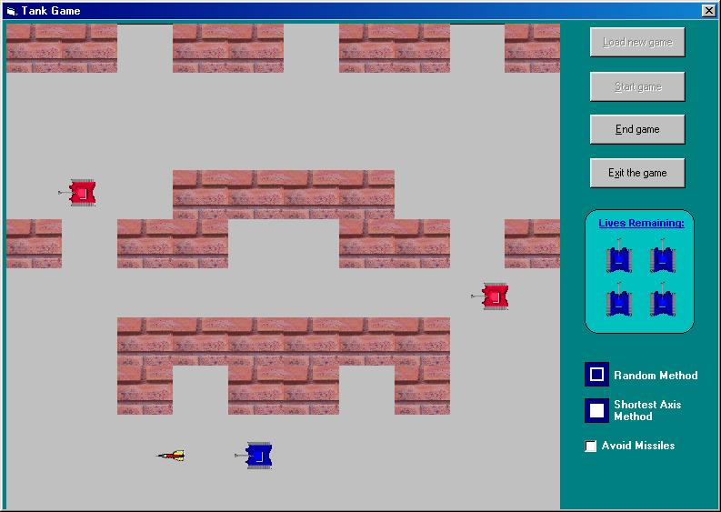

<div align="center">

## AI Tank Game


</div>

### Description

This is a tank game that allows enemy tanks to shoot a player tank. It was initially designed as an artificial intelligence mini-project. The program allows a user to create maps and then play them.
 
### More Info
 
The first screen is a map editor (click on game screen to play).

The program has not been tested thoroughly and certain bugs may exist. System requirements are pretty high i.e. Pentium with 32 megs ram preferably.

Any feedback is welcome.


<span>             |<span>
---                |---
**Submitted On**   |2000-06-09 08:51:50
**By**             |[Antony And Vince](https://github.com/Planet-Source-Code/PSCIndex/blob/master/ByAuthor/antony-and-vince.md)
**Level**          |Intermediate
**User Rating**    |4.8 (19 globes from 4 users)
**Compatibility**  |VB 5\.0, VB 6\.0
**Category**       |[Games](https://github.com/Planet-Source-Code/PSCIndex/blob/master/ByCategory/games__1-38.md)
**World**          |[Visual Basic](https://github.com/Planet-Source-Code/PSCIndex/blob/master/ByWorld/visual-basic.md)
**Archive File**   |[CODE\_UPLOAD6578692000\.zip](https://github.com/Planet-Source-Code/antony-and-vince-ai-tank-game__1-8742/archive/master.zip)

### API Declarations

```
Declare Function PlaySound Lib "winmm.dll" Alias "PlaySoundA" (ByVal lpszName As String, ByVal hModule As Long, ByVal dwFlags As Long) As Long
Declare Sub Sleep Lib "kernel32.dll" (ByVal dwMilliseconds As Long)
```


